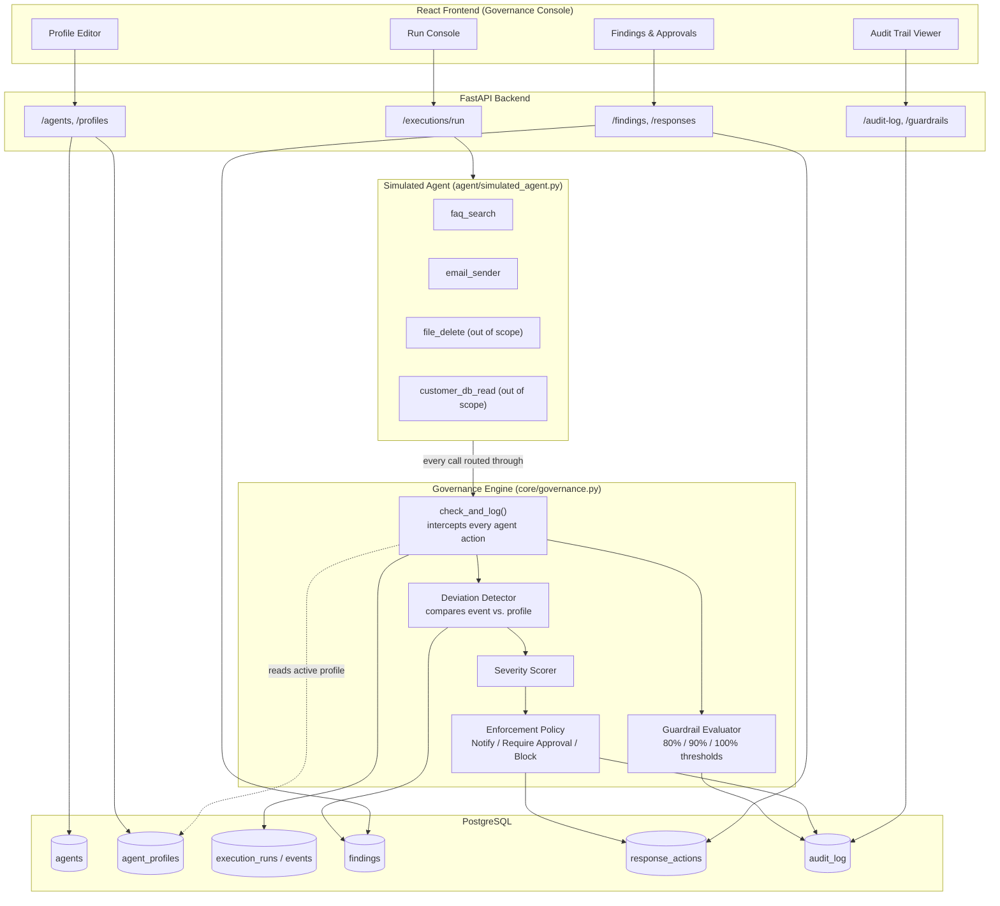
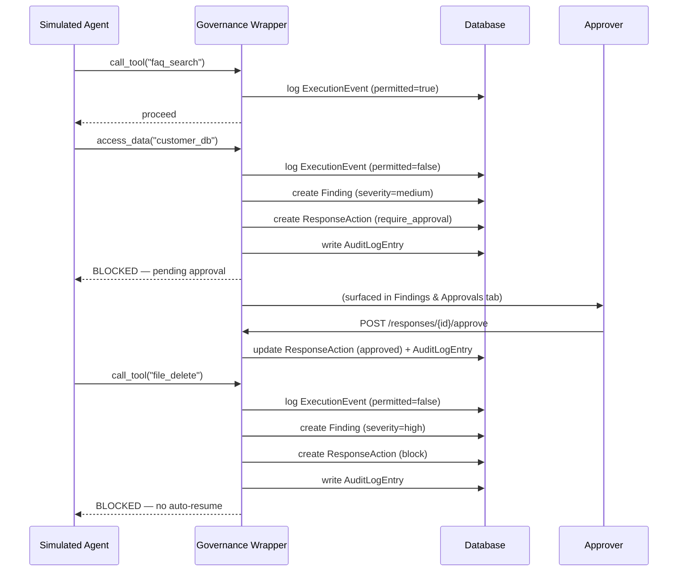

# FLYYY.AI — AI Agent Governance Console

An application that defines, monitors, detects, and enforces AI agent
behaviour against an approved profile — built for the FLYYY.AI take-home
assignment ("Catching Agents Doing What They Shouldn't").

> **Live demo: https://flyyy-ai-governance.vercel.app/   (able to run and edit in the dashboard only if the docker engine is on running mode)
>

---

## 1. Problem, restated

AI agents are given tools, data access, and the ability to take actions on
an organization's behalf. As they act autonomously, an organization needs
to answer, continuously and in real time:

- What is this agent *allowed* to do?
- Is its *actual* behaviour still inside those boundaries?
- If not — what evidence do we have, how severe is it, and what happens next?
- Is there a complete record of what happened and who decided what?

This project treats those four questions as four subsystems: **Profile →
Detection → Enforcement → Audit**.

---

## 2. System architecture



**Why this shape:** the governance engine sits as a single choke point
(`check_and_log`) that every agent action must pass through *before*
execution. This is what makes enforcement real — not a dashboard that
reports violations after the fact, but a wrapper that can refuse to let
a disallowed action happen at all.

> An editable Excalidraw version of this diagram is at
> `docs/architecture.excalidraw` — open it at [excalidraw.com](https://excalidraw.com)
> via File → Open.

---

## 3. Agent behaviour flow (end-to-end)




Agent Deviation → Detection → Warning/Finding → Response → Block/Approval → Audit Trail

---

## 4. Behaviour Profile design

A profile is intentionally a flat, explicit allow-list rather than a
rules DSL — chosen for auditability (a compliance reviewer can read it
in seconds) over expressiveness:

```json
{
  "allowed_tools": ["faq_search", "email_sender"],
  "allowed_data_sources": ["faq_database"],
  "allowed_actions": ["read", "send_email"],
  "guardrails": {
    "max_calls_per_day": { "limit": 1000, "warning_pct": 80, "critical_pct": 90 }
  }
}
```

Any `tool_call`, `data_access`, or `action` event whose `resource_name`
isn't in the matching list is a deviation. **Default is fail-closed**: an
agent with no active profile is denied everything, not permitted
everything — a deliberate safety-first design decision.

---

## 5. Detection approach

Every attempted action becomes an `ExecutionEvent` (logged **regardless**
of outcome — this gives a complete record, not just a violations log).
If `_is_permitted()` returns false, a `Finding` is created carrying:

- which agent, which run, which event
- `expected_behavior` (the approved set) vs `actual_behavior` (what was attempted)
- a `deviation_type` (`unauthorized_tool` / `unauthorized_data` / `unauthorized_action` / `guardrail_exceeded`)
- a timestamp and the originating run ID

Guardrails (numeric/rate limits) are evaluated separately from
identity/permission checks, since they're a different governance
concern — a call can be individually "permitted" and still push the
agent over a usage threshold.

## 6. Severity & enforcement mechanism

Severity is scored via a keyword heuristic on the resource name
(`delete`, `drop`, `payment`, `admin`, `credential` → high;
`write`, `update`, `customer`, `database` → medium; else low). This maps
directly to the assignment's requested progression:

| Severity | Response       | Effect                                             |
|----------|----------------|-----------------------------------------------------|
| Low      | Notify         | Logged, agent continues                              |
| Medium   | Require Approval | Agent halted until a human approves/rejects via API/UI |
| High     | Block          | Agent halted immediately, no auto-resume              |

All three transitions (and every human decision) are written to
`audit_log` with actor, timestamp, and reason.

---

## 7. Tech stack

| Layer      | Choice                          |
|------------|----------------------------------|
| Backend    | Python 3.12, FastAPI              |
| Database   | PostgreSQL (SQLAlchemy ORM)       |
| Frontend   | React 18 + Vite (no UI framework — hand-styled) |
| Agent      | Lightweight scripted agent, no LangGraph/LangChain — see §9 |

---

## 8. Project structure

```
flyyy-ai-governance/
├── backend/
│   ├── app/
│   │   ├── core/
│   │   │   ├── database.py        # SQLAlchemy engine/session
│   │   │   └── governance.py      # THE governance engine (detection + enforcement)
│   │   ├── models/models.py       # ORM models
│   │   ├── schemas/schemas.py     # Pydantic request/response schemas
│   │   ├── routers/               # agents, profiles, executions, findings/responses/audit
│   │   ├── agent/simulated_agent.py  # test environment (governed tool calls)
│   │   ├── seed.py                # demo data matching the assignment's own example
│   │   └── main.py
│   ├── requirements.txt
│   └── Dockerfile
├── frontend/
│   ├── src/
│   │   ├── api/client.js
│   │   ├── components/            # Sidebar, ProfileTab, RunConsoleTab, FindingsTab, AuditTab, Stamp
│   │   ├── App.jsx
│   │   └── styles.css             # design tokens
│   └── package.json
└── docker-compose.yml              # one-command local stack (Postgres + API)
```

---

## 9. Key design decisions & trade-offs

- **Generic agent, driven by whatever profile it's given.** The simulated
  agent (`agent/simulated_agent.py`) doesn't hardcode any one agent's tool
  names. For the "normal" scenario it reads the *active profile of the
  agent being run* and exercises exactly those tools/data sources/actions
  — so it works correctly for the seeded Customer Support Agent AND for
  any new agent + profile created through the UI. For the "deviation"
  scenario it additionally attempts three fixed, deliberately out-of-scope
  probes (an admin-flavoured tool call, a customer-data access, and a
  bulk-delete action) chosen so the severity scorer reliably classifies
  them as medium/high — giving a consistent demo of both enforcement
  tiers regardless of the agent's own profile contents.
- **Wrapper/middleware interception over post-hoc log analysis.** Chose
  to intercept and evaluate *before* execution so the system can actually
  block, not just report. Trade-off: every tool integration must be
  routed through the wrapper — there's no way to monitor an agent that
  bypasses it, which is true of any enforcement point in a real system too.
- **No agent framework (LangGraph/LangChain).** The assignment says to use
  one only if it adds clear value. Since the focus is the governance
  layer, not agent reasoning, a small scripted agent keeps the demo
  legible and keeps 100% of the 4-day budget on the governance engine
  itself. The interception pattern (`check_and_log` before every tool
  call) is exactly how you'd wrap a LangChain `Tool` or LangGraph node
  in production — swapping in a real framework would mean moving the
  `engine.check_and_log()` call into that framework's tool-execution
  hook, not redesigning the governance engine.
- **Fail-closed default.** An agent with no profile is denied everything.
  Safer default for a governance product; documented so reviewers know
  it's intentional, not an oversight.
- **Flat allow-lists over a rules DSL.** Trades expressiveness for
  auditability — matches the assignment's own example profile shape
  exactly.
- **Simple keyword-based severity scoring.** A real system would use a
  configurable, per-resource risk policy (and likely ML-assisted
  anomaly scoring for behavioural drift, not just identity checks).
  Named explicitly as a limitation below.

## 10. Known limitations

- Severity scoring is a keyword heuristic, not a configurable policy engine.
- Guardrail evaluation currently covers one guardrail type (rolling
  call-count); the schema supports arbitrary named guardrails but only
  `max_calls_per_day` has a checker implemented.
- No authentication/authorization on the API — every request is treated
  as coming from a trusted internal user. A production version would add
  auth and scope the audit trail's `actor` field to real identities.
- `Base.metadata.create_all()` is used instead of Alembic migrations,
  appropriate for a 4-day scope but not for a long-lived schema.
- Tool/data-source/action *execution* is a labelled simulation
  (`[SIMULATED] ...`), not a real side effect — appropriate since tool
  names are arbitrary strings supplied through the profile editor at
  runtime, and the artifact being demonstrated is the governance
  decision, not the tool's business logic.
- "Live Monitor" (Run Console) demonstrates continuous, real-time
  detection and enforcement against the actual governance engine —
  every tick is a real evaluated call, not replayed data. It is not,
  however, a generic connector to an arbitrary external agent/model
  source; it draws its live traffic from the same simulated-agent layer
  as the other two modes. Wiring it to a real external agent would mean
  routing that agent's tool-execution layer through
  `GovernanceEngine.check_and_log()` the same way `SimulatedAgent` does
  — the interception pattern is what would carry over, not this file.

## 11. Testing

An automated pytest suite lives in `backend/tests/test_governance.py`
and covers: agent/profile CRUD, clean runs, deviation detection with
evidence, severity → response-tier mapping, the approval/rejection
workflow (including double-approval rejection), guardrail threshold
warnings, and audit trail completeness. Run it with:

```bash
cd backend
pytest tests/ -v
```

It uses an isolated in-memory-style SQLite file per run, so it never
touches your real Postgres database.

## 12. What I'd add next

- Per-resource configurable risk scoring instead of keyword matching
- Real LLM-driven agent (via LangGraph) with the same wrapper reused
  unmodified — validates the interception pattern generalizes
- Role-based auth so `approver` in the audit trail is a real identity
- WebSocket push for live findings instead of polling on tab switch

---

## 13. Setup — local development

### Option A: Docker Compose (recommended — no Python/Node install needed)

```bash
docker compose up --build
```

This single command starts Postgres, seeds a demo "Customer Support Agent"
with an approved profile, starts the API on `http://localhost:8000`, and
builds + serves the frontend on `http://localhost:5173`. Nothing else
needs to be installed on your machine besides Docker itself.

Visit `http://localhost:5173` once the logs settle (first build takes a
minute or two; subsequent runs are fast).

### Option B: Manual

```bash
# Postgres running locally on 5432 with a `flyyy_governance` database
cd backend
python -m venv venv && source venv/bin/activate
pip install -r requirements.txt
cp .env.example .env   # edit DATABASE_URL if needed
python -m app.seed     # optional: creates demo agent + profile
uvicorn app.main:app --reload
```

```bash
cd frontend
npm install
cp .env.example .env
npm run dev
```

### API docs

FastAPI auto-generates interactive docs at `http://localhost:8000/docs`
once the backend is running.

---

## 14. Demo script (matches the assignment's End-to-End Example)

1. Open the console, select **Customer Support Agent** (seeded).
2. **Profile tab** — confirm the approved tools/data/actions match the brief.
3. **Run Console tab** → **Run: Normal behaviour** — all steps show `executed`.
4. **Run Console tab** → **Run: Induce deviation** — on top of its normal
   steps, the agent attempts an unauthorized data read (medium severity →
   paused for approval), an unauthorized tool call, and an unauthorized
   bulk action (both high severity → blocked).
5. **Findings & Approvals tab** — see all findings with full evidence;
   approve or reject the pending one.
6. **Audit Trail tab** — see the complete recorded sequence: deviation
   detected → response triggered → approval decision, plus guardrail
   usage against the configured daily limit.
7. **Try it with a second agent** — click **+ Register new agent**, give
   it a completely different profile (different tool/data/action names),
   and repeat steps 3–4. The simulated agent adapts to whatever profile
   you gave it — normal runs stay clean, and the same three deliberate
   probes still get caught and enforced, proving the detection/enforcement
   logic isn't hardcoded to the seeded example.

---

## 15. Deployment

- **Backend:** deploy `backend/` (with its `Dockerfile`) to Render, Railway,
  or Fly.io; attach a managed PostgreSQL instance and set `DATABASE_URL`.
- **Frontend:** deploy `frontend/` to Vercel or Netlify; set `VITE_API_URL`
  to the backend's public URL. Remember to update the backend's CORS
  `allow_origins` from `["*"]` to the frontend's real origin before
  submitting.
